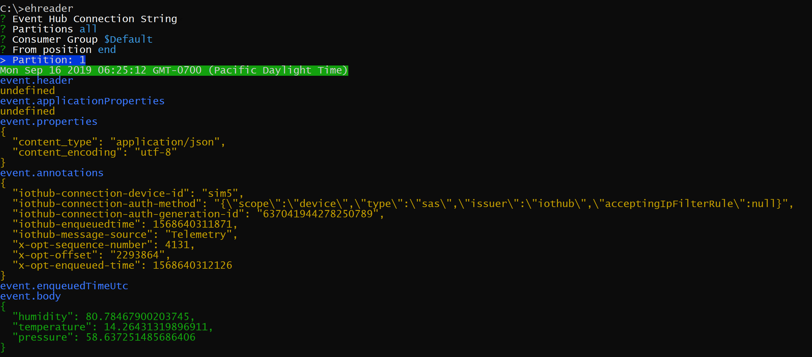

# ehreader
A command line tool to read data from Azure Event Hubs

## Install
`npm install -g ehreader`

## Run
`ehreader`

Follow the prompt.
Note that the event hub connection string must contain EntityPath.

